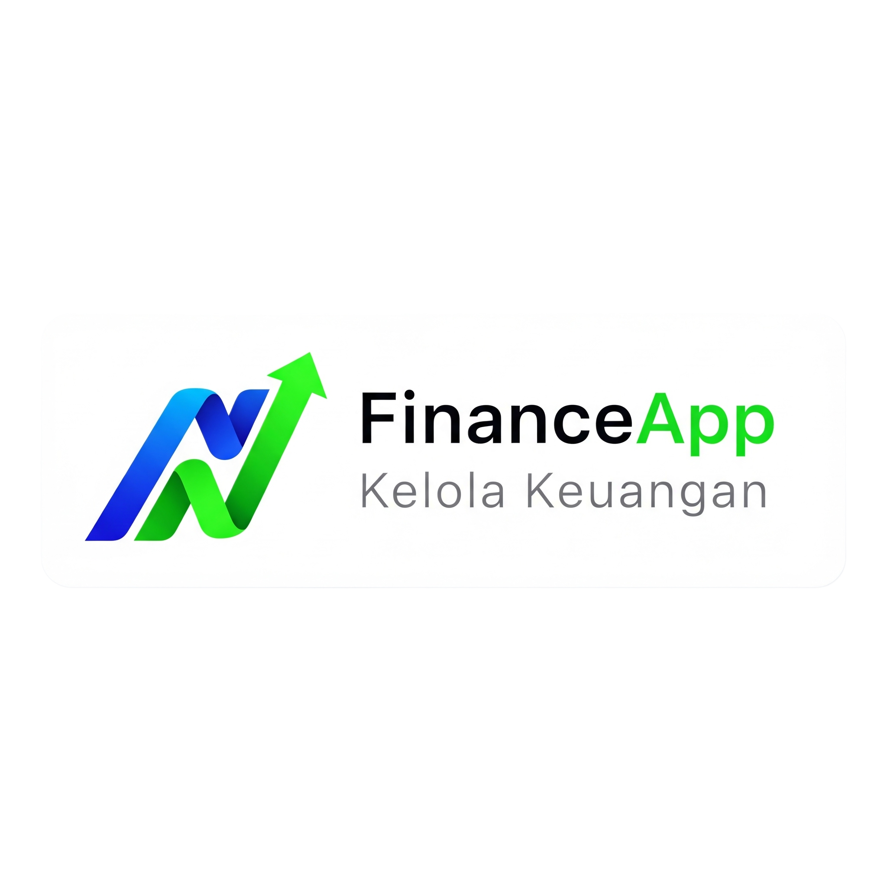
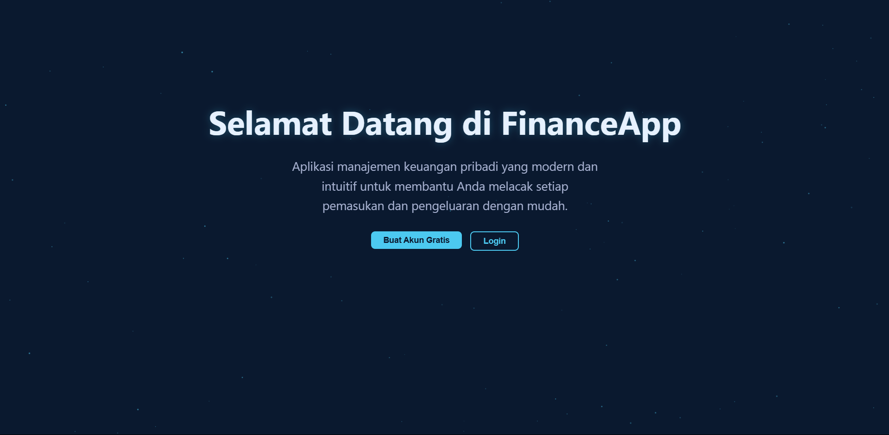

#  FinanceApp - Aplikasi Keuangan Pribadi Modern



<p align="center">
  
  
  
  
</p>

<p align="center">
  Sebuah aplikasi web manajemen keuangan pribadi yang dibangun dari awal menggunakan React.js, dirancang untuk memberikan pengalaman pengguna yang intuitif, modern, dan kaya fitur. Lacak setiap pemasukan dan pengeluaran, atur anggaran, dan dapatkan wawasan mendalam tentang kesehatan finansial Anda.
</p>

<p align="center">
  <strong><a href="https://aplikasi-keuangan-pribadi.vercel.app/">Lihat Demo Langsung »</a></strong>
</p>

---

## ✨ Fitur Utama

Aplikasi ini dirancang dengan serangkaian fitur komprehensif untuk memberikan kontrol penuh atas keuangan Anda:

*   **🔐 Autentikasi Pengguna:** Sistem registrasi dan login yang aman menggunakan **Firebase Authentication**, lengkap dengan validasi dan alur yang profesional.
*   **📊 Dashboard Interaktif:** Ringkasan visual instan dari total saldo, pemasukan, dan pengeluaran bulanan.
*   **💼 Manajemen Multi-Akun:** Buat dan kelola beberapa "dompet" virtual (misalnya, Rekening Bank, Tunai, E-Wallet) untuk pencatatan yang akurat.
*   **🔄 Pencatatan Transaksi (CRUD):** Tambah, lihat, **edit**, dan hapus pemasukan atau pengeluaran dengan formulir cerdas yang memiliki format angka otomatis.
*   **🎨 Kategori Dinamis:** Personalisasi aplikasi dengan membuat dan menghapus kategori pengeluaran Anda sendiri.
*   **🎯 Anggaran Bulanan:** Tetapkan batas pengeluaran untuk setiap kategori dan lacak progres pemakaian secara visual dengan *progress bar*.
*   **💰 Tujuan Menabung (Savings Goals):** Buat target finansial, alokasikan dana, dan lacak progres tabungan Anda untuk mencapai impian.
*   **🔁 Template Transaksi:** Simpan transaksi rutin (seperti gaji atau tagihan) sebagai template untuk input data yang lebih cepat dengan satu klik.
*   **📈 Analisis & Visualisasi Data:**
    *   Grafik batang perbandingan pemasukan vs. pengeluaran dari waktu ke waktu.
    *   Grafik garis interaktif untuk melihat tren pengeluaran per kategori, lengkap dengan filter rentang waktu dan pemilih kategori.
*   **🌓 Tema Terang & Gelap:** Beralih antara mode terang dan gelap yang indah, lengkap dengan animasi latar belakang partikel yang unik dan dinamis untuk setiap tema.
*   **📱 Desain Responsif (Mobile-First):** Tampilan yang dioptimalkan untuk pengalaman yang mulus di perangkat desktop, tablet, dan mobile.
*   **💎 Interaksi Modern:** Dilengkapi dengan notifikasi *toast*, modal konfirmasi SweetAlert2 yang sesuai tema, dan animasi halus menggunakan Framer Motion.
*   **🔌 Mode Hybrid (Online/Offline):** Berjalan mulus dengan **Firebase** untuk sinkronisasi cloud atau beralih otomatis ke **mode lokal (`localStorage`)** jika koneksi Firebase tidak dikonfigurasi.

---

## 🎨 Galeri Tampilan

<table>
  <tr>
    <td align="center"><br><sub><b>Dashboard (Mode Gelap)</b></sub></td>
    <td align="center"><br><sub><b>Dashboard (Mode Terang)</b></sub></td>
  </tr>
  <tr>
    <td align="center"><br><sub><b>Formulir Transaksi Cerdas</b></sub></td>
    <td align="center"><br><sub><b>Manajemen Anggaran</b></sub></td>
  </tr>
    <tr>
    <td align="center"><br><sub><b>Template Transaksi</b></sub></td>
    <td align="center"><br><sub><b>Manajemen Akun/Dompet</b></sub></td>
  </tr>
  <tr>
    <td align="center"><br><sub><b>Analisis Keuangan</b></sub></td>
    <td align="center"><br><sub><b>Desain Responsif Mobile</b></sub></td>
  </tr>
</table>

---

## 🛠️ Tumpukan Teknologi

*   **Framework:** [React.js](https://react.dev/)
*   **Build Tool:** [Vite](https://vitejs.dev/)
*   **Backend & Database:** [Firebase](https://firebase.google.com/) (Authentication & Firestore)
*   **Styling:** CSS Modules & Variabel CSS
*   **Routing:** [React Router](https://reactrouter.com/)
*   **Manajemen State:** React Context API
*   **Visualisasi Data:** [Recharts](https://recharts.org/)
*   **Animasi:** [Framer Motion](https://www.framer.com/motion/) & [React TSParticles](https://github.com/matteobruni/tsparticles)
*   **Komponen UI:** [React Select](https://react-select.com/), [SweetAlert2](https://sweetalert2.github.io/), [React Hot Toast](https://react-hot-toast.com/)
*   **Ikon:** [React Icons](https://react-icons.github.io/react-icons/)
*   **Deployment:** [Vercel](https://vercel.com/)

---

## 🚀 Menjalankan Proyek Secara Lokal

Proyek ini dapat dijalankan dalam dua mode: **Mode Offline** (tanpa setup) atau **Mode Online** (dengan Firebase).

### 1. Prasyarat

*   Pastikan Anda memiliki [Node.js](https://nodejs.org/) (versi 16 atau lebih tinggi) dan [Git](https://git-scm.com/) terinstal.

### 2. Instalasi

Clone repository ini dan install semua dependensi:
```bash
git clone https://github.com/VicoTriansyahNasril/aplikasi-keuangan-pribadi.git
cd aplikasi-keuangan-pribadi
npm install
```

### 3. Menjalankan Aplikasi

#### 🏃‍♂️ Mode Offline (Cara Cepat)
Cara termudah untuk mencoba aplikasi. Tidak memerlukan akun Firebase. Data akan disimpan di `localStorage` browser Anda.

```bash
npm run dev
```

Buka http://localhost:5173 di browser Anda.

Buat Proyek Firebase:
* Buka Firebase Console dan buat proyek baru.
* Di dalam proyek, aktifkan Authentication (pilih provider Email/Password) dan buat Firestore Database.
* Konfigurasi Kredensial:
* Salin file .env.example menjadi file baru bernama .env.
* Buka Pengaturan Proyek (Project Settings) di Firebase dan temukan konfigurasi aplikasi web Anda.
* Salin kredensial tersebut ke dalam file .env Anda.

```bash
# .env
VITE_USE_FIREBASE=true

VITE_FIREBASE_API_KEY=xxxxxxxxxxxxxxxx
VITE_FIREBASE_AUTH_DOMAIN=xxxxxxxxxxxxxxxx
VITE_FIREBASE_PROJECT_ID=xxxxxxxxxxxxxxxx
VITE_FIREBASE_STORAGE_BUCKET=xxxxxxxxxxxxxxxx
VITE_FIREBASE_MESSAGING_SENDER_ID=xxxxxxxxxxxxxxxx
VITE_FIREBASE_APP_ID=xxxxxxxxxxxxxxxx
```

Jalankan Aplikasi:
```bash
npm run dev
```
Aplikasi sekarang akan terhubung ke database Firebase Anda.
* Terima kasih telah melihat proyek ini!
